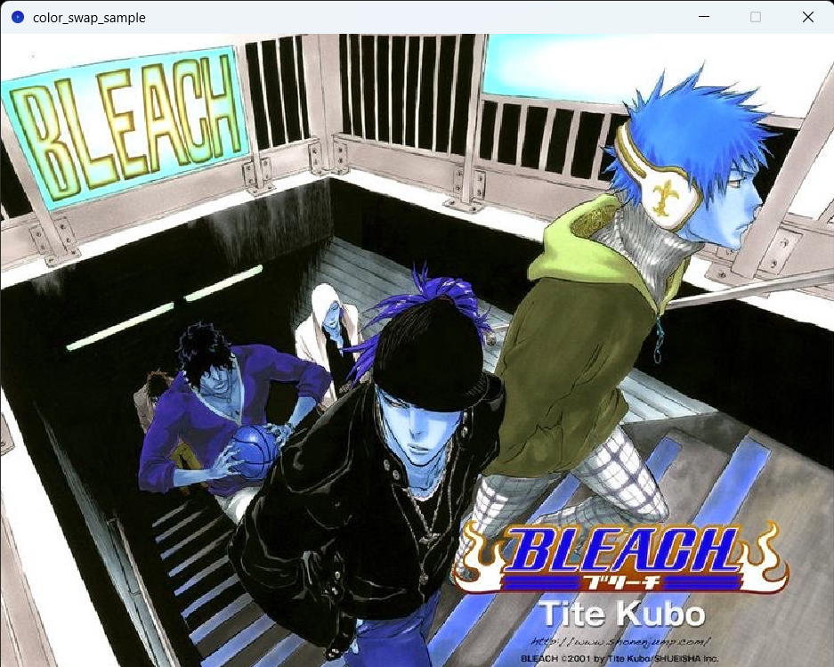
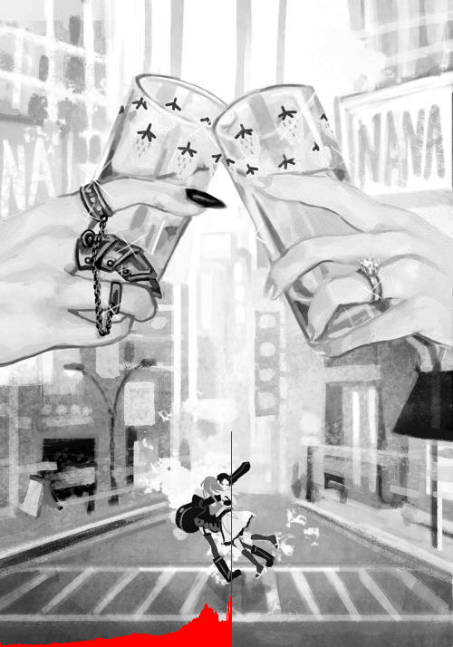
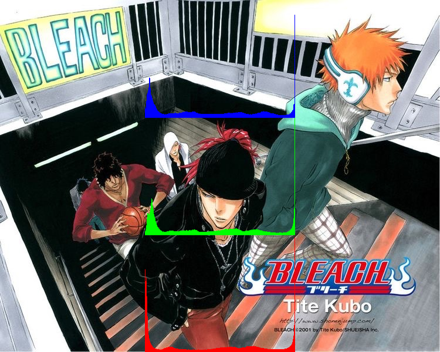

# Week-02 Task
Above I have uploaded some sketches I completed in class as examples. We learned how to switch colors by changing pixels and how to adjust image brightness. I've included photos below of my samples along with the main histogram task.

**Task 2: histogram:**
This sketch displays a color image and displays it on screen. Using what I learned from my previous histogram test, I adapted the code to draw three seperate histograms for the RGB channels.

# Requirements 
*Written in Processing 4.3*
*No special libraries required*

# Operation

# Screengrab

# Design Notes
- Found it quite challenging placing the histograms where I wanted it to be
- Have the histograms fit perfectly to the image size
- Was not able to save frame properly for color swap sample (unsure)

