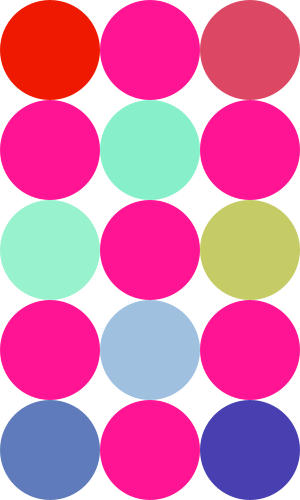

# Week-03 Task
For this task, I have created a grid of circles which are arranged in a checkerboard pattern using Processing. Each of the circle alternates between a fixed pink color and a random color, to generate this I used the random() function. I have also included the modulo operator to helpalternate between the sets of values.

I have also a attached a PNG image of the circles and a screen recording of the code running.

# Requirements
*Written in Processing 4.3*
*No special libraries requires*

# Operation

# Screengrab

*Link to recording*
https://drive.google.com/drive/folders/1LxlpM2JBOmjJXTvOz71mZVYSc1shkNNU?usp=drive_link
