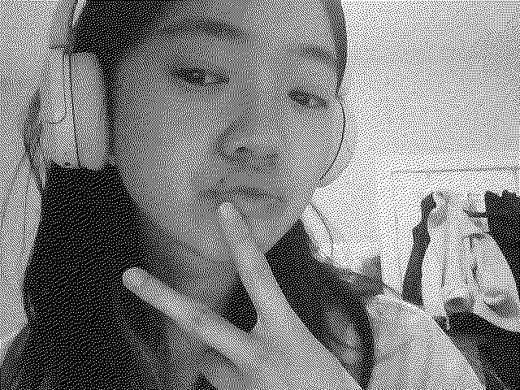

# Week-05 Task
For this task I originally began experimenting with Floyd-Steinbergs dithering algorithim which we learned about in class using and uploaded image. I have chosen an image of my favourite show 'goodmorning call'. I also tested a sepia filter onto the camera and it turned out really well. 

**Dithering Camera Frame Task**
This sketch uses the webcam to apply Floyd-Steinberg dithering in real time, turning the live video into a black and white pixel effect. 

When 'ENTER' is pressed it saves up to 10 frames.

Below I have attached images of the dithering outcome and the other task images at the end.

# Requirements
*Written in Processing 4.3*
*Imported Processing video*

# Operation
*Press ENTER for screengrab*

# Screengrab

